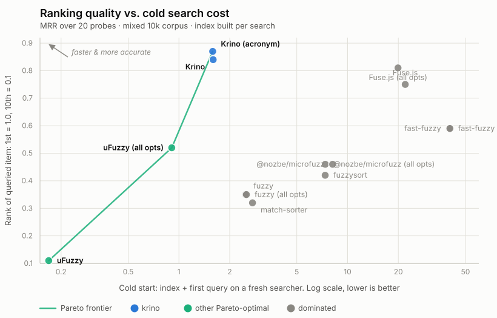

# Krino

> Tiny, typed fuzzy matching

- **~5.4 kB** gzip, zero dependencies, TS-first, ESM/CJS
- **~1 ms per query** across a real 10k session (3.9 ms at 100k), measured process-cold, optimised for search-as-you-type
- **Tops match-quality scorecard** across 20 probes
- **Returns** `tier`, `ranges` and `score` on every match: easily rank, highlight and explain
- **Diacritics, multi-word, acronyms, one-edit typos** built in

Krino (Ancient Greek κρίνω, KREE-no, "to sift, separate"; the root of criterion, discern, and critic) is a fuzzy text matcher: it sifts a list and judges each candidate against a criterion.
Corrects single-character typos, not general edit distance, in exchange for the size and speed.
Inspired by [@nozbe/microfuzz](https://github.com/Nozbe/microfuzz), and [benchmarked](./docs/benchmarks.md) against it and six others.

## Install

```bash
npm i krino  # or pnpm add krino
```

> **Coming from `@mmmike/mikrofuzz`?** See [MIGRATION.md](./MIGRATION.md).

## Usage

### `createFuzzySearch`: search a collection

```typescript
import { createFuzzySearch, SCORES } from "krino";

// array of strings
const search = createFuzzySearch(["apple", "banana", "cherry"]);
search("ban"); // [{ item: "banana", score: 0.5, fields: [...] }]

// objects: a function extracts the text to search
const byName = createFuzzySearch(users, (u) => u.name);
byName("john");

// multiple fields, per-field config
const posts = [
  { title: "Banana bread", body: "best baked goods" },
  { title: "Release notes", body: "banana picker shipped" },
];
const byField = createFuzzySearch(posts, [
  { text: (p) => p.title },
  { text: (p) => p.body, atBest: SCORES.CONTAINS }, // body's best hit ranks like a bare contains
]);
byField("ban");
// [
//   { item: posts[0], score: 0.5, fields: [{ score: 0.5, tier: "prefix", ranges: [[0, 2]] }, null] },
//   { item: posts[1], score: 2.5, fields: [null, { score: 2.5, tier: "prefix", ranges: [[0, 2]] }] },
// ]
// item score = the best field score; body scores are shifted by atBest (0.5 + 2 = 2.5),
// so the title hit leads even though both are prefix matches.
```

Results are sorted best-first (stable), and preprocessing is cached; the index is built on the first call and reused by every query after.

### `fuzzyMatch`: the primitive underneath

Scores one string against a query; reach for it directly when there is no list, e.g. matching inside a document.

```typescript
import { fuzzyMatch } from "krino";

fuzzyMatch("Hello World", "wor");
// { score: 1, tier: "boundary", ranges: [[6, 8]] }

fuzzyMatch("cherry", "xyz"); // null
```

Options: `fuzzyMatch(text, query, { acronym? })`.
`acronym: true` adds the initials tier (`rsaw` finds "Rath, Streich and Witting" at rank 1) for a sub-millisecond bump in query cost.

## Where it fits

- **Command palettes and pickers**: `tier` + `ranges` rank and highlight results without reverse-engineering a score.
- **Search-as-you-type**: each keystroke rescans only the previous one's survivors, so the first keystroke is the expensive one and the last costs 6× less, even over 100k items.
- **Filter UIs that show every match**: the narrowest result sets of the subsequence engines; a structured query returns a median of 7 rows where Fuse.js ships ~90.
- **Backend one-shot lookups**: constructor + first answer costs ~6 ms in a genuinely cold process over 10k items, so indexing per request is fine.
- **Finding a phrase inside a document**: `fuzzyMatch` scans 16,000 characters in 0.28 ms, and the density floor keeps absent words at exactly 0 false matches.

## Scoring

Lower is better. Each match reports a numeric `score` (for sorting) and a categorical `tier`:

| score | tier               | meaning                                    |
|-------|--------------------|--------------------------------------------|
| 0     | `exact`            | exact match                                |
| 0.1   | `normalised-exact` | case / diacritics-insensitive exact        |
| 0.5   | `prefix`           | starts with query                          |
| 0.9   | `boundary-exact`   | at a word boundary, exact case             |
| 1     | `boundary`         | at a word boundary                         |
| 1.5   | `multi-word`       | all query words present, any order         |
| 1.8   | `acronym`          | word initials (opt-in via `acronym: true`) |
| 2     | `contains`         | contains query anywhere                    |
| > 2   | `fuzzy`            | fuzzy chain (fewer chunks = better)        |
| +2.1  | `corrected`        | one-character typo fixed (`genric`)        |

A `corrected` match scores as the corrected query's tier + 2.1, which puts even a corrected exact hit above `contains` (2).
A correction is a guess at what you meant; a substring match is something you actually typed, so the literal hit always ranks first.
`score <= SCORES.CONTAINS` is therefore exactly "the query text appears here", and filtering to it opts out of typo matching entirely.

Import `SCORES` for thresholds and `atBest` values; or read `tier` directly:

```typescript
results.filter((r) => r.score <= SCORES.CONTAINS); // drop fuzzy chains and deep rescues
results.filter((r) => r.fields[0]?.tier !== "fuzzy"); // drop fuzzy chains only, categorically
```

A `corrected` match carries the fixed query, so you can say what you searched for:

```typescript
const top = results[0]?.fields[0];
if (top?.tier === "corrected") notice(`Showing results for ${top.corrected}`);
```

`atBest` shifts `score` but never `tier`, so tier filters stay reliable on demoted fields (a body-field prefix hit can report `score: 2.5, tier: "prefix"`).
All four typo tiers also score above `CONTAINS` (a rescued contains is 4.1) without being fuzzy chains, so filter by `tier` when you mean the kind of match.

> **Long text:** a fuzzy chain assembled from chunks scattered across a document is junk; unguarded, a word *absent* from the text still "matches" 35% of the time by 512 chars, ~100% by 16k.
> The fuzzy tier refuses any assembly covering less than 18% of its span (measured junk density never exceeds 0.143, the sparsest genuine match is 0.211), which holds the junk rate at **0% at every measured length** with label behaviour unchanged ([the long-text table](./docs/benchmarks.md#matching-inside-long-text)).

> **Acronym semantics:** apostrophes are word-internal: `People's` contributes one initial, `p`, so `lpdr` matches `Lao People's Democratic Republic`.
> Stopwords count too: `Democratic Republic of the Congo` is `drotc`, and `drc` matches nothing (the density floor rejects so sparse a chain).

## The fuzzy tier

Krino ships one opinionated fuzzy mode, always on, with no strategy knob: chunks must start at a word boundary or run 3+ characters (the query's last 1-2 characters are exempt, since a short tail could never satisfy the run rule), and the whole assembly must cover at least 18% of the span it stretches across (the density floor that keeps long text junk-free).
Anything it refuses either matched a higher tier already or wasn't worth showing; filter `tier === "fuzzy"` out of the results if you want literal matches only.

## Comparison

Speed is not the constraint at any realistic size: a twenty-query session over 100,000 items averages ~3.9 ms per query after the first (~1 ms at 10k), every number measured in a fresh, cold process, and `fuzzyMatch` over a 16,000-character document costs 0.29 ms.
What separates these libraries is **match quality** and **what you get back**.
Accuracy against the total cost of one cold search (index + one query) — the least flattering ledger for Krino, since a no-index library pays nothing up front (the mixed 10k scorecard from [docs/benchmarks.md](./docs/benchmarks.md); the frontend chart there, query cost only, is a Krino-only frontier):

<picture>
  <source media="(prefers-color-scheme: dark)" srcset="./docs/pareto-total-dark.svg">
  
</picture>

Krino is the only library that by default:

- returns a categorical **`tier`** *and* numeric `ranges`
- folds diacritics
- matches multi-word
- takes per-field config

The full feature matrix, verified per cell against each library's current source, is in [docs/benchmarks.md](./docs/benchmarks.md#libraries).
Originally written for matching in-memory lists on the client, Krino has proven to be a competitive option for serverside work.

### Results, in short

Full method and data live in [docs/benchmarks.md](./docs/benchmarks.md).

- **Match quality**: Krino returns the smallest result set of the subsequence libraries and ranks the queried item **first on every structured query**; a one-char slip still matches, and at two dropped chars it returns nothing where its parent returns 67 junk chains.
  A transposition, an insertion and a substitution each break the subsequence property; Krino's four one-edit tiers take all three at rank 1 with a single row, where the subsequence engines return nothing at all.
  A typo inside a phrase is corrected too: the words that do occur pin the field, and only the failing word is rescued. Two or more edits in one query remain the edit-distance engines' edge.
- **Speed, measured cold**: a twenty-query session (one searcher, twenty distinct queries, fresh process) runs 21 ms at 10k and 83 ms at 100k — 2.5–42× under everything above 0.5 MRR, ~1–4 ms per query after the first.
  The lazy preparation lands its whole bill on the first query (~5.5 ms at 10k, ~23 ms at 100k), the cold column in [docs/benchmarks.md](./docs/benchmarks.md); only bare-output uFuzzy runs the session cheaper, at a fraction of the match quality.
  A prefix-narrowing cache makes the keystrokes after the first cheaper as the phrase grows.

### What to pick when

**Pick Krino.** It tops the quality scorecard on both benchmark corpora outright and runs the cheapest realistic session of anything above 0.5 MRR at every published size.
At ~5.4 kB gzip it sits mid-pack on size: the one-edit rescue machinery bought the quality lead (the unfold table is generated from the fold logic at first use, not shipped), and Fuse.js and fast-fuzzy are 1.7–2× larger.
One workload genuinely points elsewhere:

- **Typos beyond a single edit must still match** (user-typed queries over messy data): the four typo tiers cover every one-character mistake, but two or more edits in one query need real edit distance. Pick `Fuse.js` (Bitap) or `fast-fuzzy`, at 1.7–2× the bundle, ~7–19 ms queries, and ~90–450-row result sets.

The rest of the field is dominated on these benchmarks; the full argument, per-library, is in [the recommendation](./docs/benchmarks.md#the-recommendation).
(Already on `@nozbe/microfuzz`? Krino is its rebuild: same subsequence approach plus tier, ESM, and ~14–28× faster at 100k. See [MIGRATION.md](./MIGRATION.md).)

## Building blocks

- `normaliseText(text)`: lowercase, strip diacritics.
- `splitWords(text)`: tokenise on any non-alphanumeric run (keeps `_`).
- `SCORES`: the tier constants.
- `TYPO_PENALTY`: the surcharge (2.1) every `corrected` score carries over its corrected tier.

## Types

```typescript
type Range = [number, number]; // [start, end] inclusive
type Tier =
  | "exact" | "normalised-exact" | "prefix" | "boundary-exact"
  | "boundary" | "multi-word" | "acronym" | "contains"
  | "fuzzy" | "corrected";

type MatchResult = {
  score: number;
  tier: Tier;
  corrected?: string;    // the fixed query, when tier is "corrected"
  ranges: Range[];
};

type FieldSpec<T> = {
  text: (item: T) => string | null;
  acronym?: boolean;     // default false
  atBest?: number;       // shifts this field's scores; its best possible hit ranks here
};

type FuzzyResult<T> = {
  item: T;
  score: number;                       // min effective score across fields
  fields: (MatchResult | null)[];      // one per field spec
};
```

## License

MIT
