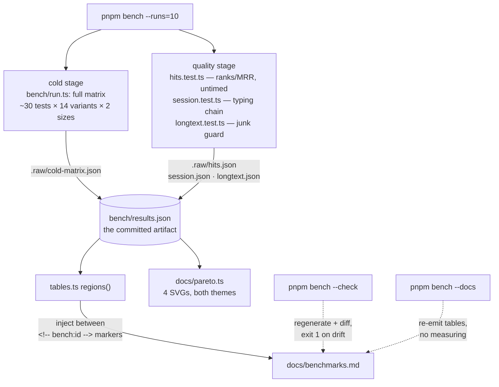
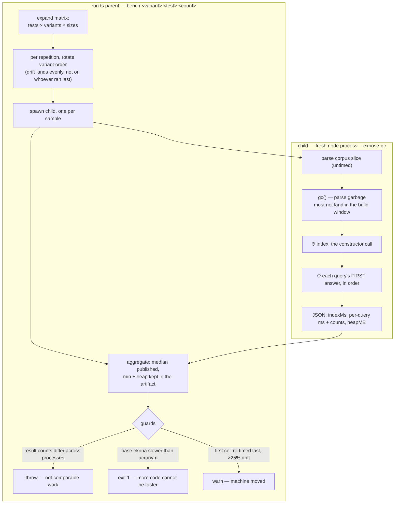
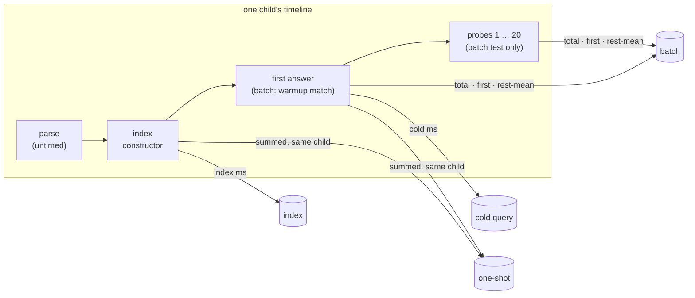
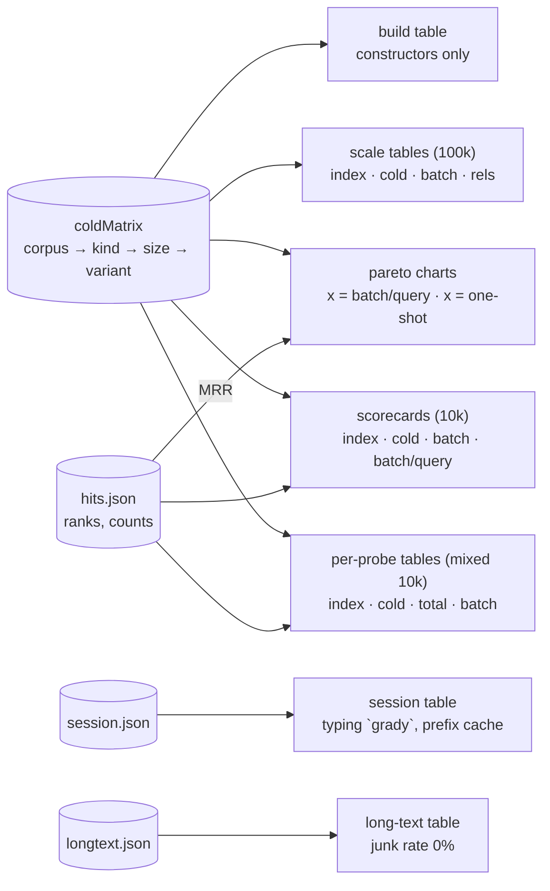

# The benchmark machinery, visually

How a number gets from a fresh node process into a published table.
Companion to [benchmarks.md](./benchmarks.md) (the numbers), [measurement.md](./measurement.md) (how the harness came to be wrong, twice), and [pipeline.md](./pipeline.md) (ekrina's own query path).

## One `pnpm bench` run

Every published cell is reproducible from the artifact, and the artifact is committed, so a number that moves is a reviewable diff.

## Inside the cold stage: process-cold by construction

Nothing warm-loops.
The JIT, every per-searcher cache, and every process-wide cache (fuzzysort's prepare pool) start empty because the process is new — no cache busting, no subtraction, no calibration blind spots.

## What each cell means

- **index** — what the constructor builds: fast-fuzzy's trie is expensive here, ekrina allocates buffers, fuzzysort has no constructor at all.
- **cold query** — the first answer, every lazy slice unpaid: ekrina's raw-gate scan and rescue mask build, fuzzysort's prepare-all, microfuzz's first-search slice all surface here, per probe kind.
- **one-shot** — index + first answer summed inside one child's consecutive windows: the whole price of "given a list, get an answer".
- **batch** — a short-word warmup match, then the twenty distinct probes once each through one process: the realistic session, and the only warmth anywhere — earned by real queries, never repetition. The warmup absorbs JIT and first-scan cost; each probe's own post-warmup time feeds the per-probe tables' `batch ms` column.

## Where each published table draws from

Ranks are deterministic, so quality is measured once, untimed; time and quality never contaminate each other's measurement.
