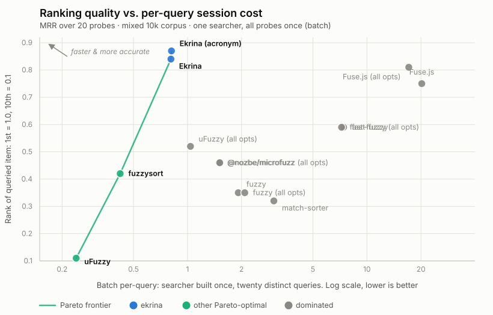

# Benchmarks: match quality and speed

Full data behind the README's summary: what each library calls a match, where it ranks the right answer, and what a query costs.
Everything here regenerates from the repo:

- `pnpm bench && node bench/report.mjs`: the speed tables
- `node bench/scorecard.mjs`: the scorecard (5 fresh processes, medianed)
- `pnpm --filter=krino-bench test`: the match/rank tables ([`bench/hits.test.ts`](../bench/hits.test.ts)) and the pre-filter funnel ([`bench/funnel.test.ts`](../bench/funnel.test.ts))

Scope a dev run to one table with `BENCH=mixed-10k pnpm bench` (tokens: a corpus, a size, or `corpus-size`, comma-separable); scoped runs skip `results.json` so they can't clobber the published matrix, which always comes from a full run.
Improvements to the benchmarks are welcome.

## How to read these numbers

The methodology lives here, once; the result sections point back to it instead of re-explaining.

### Three preparation strategies

Every query number in this document times a **prebuilt** searcher, so the first question is where each library pays for its preparation.

- **Eager**: the constructor does real work and queries ride the result.
  Krino and fast-fuzzy build here.
  Fuse.js nominally sits here too, but its trivial index defers the real work to query time.
- **Lazy**: preparation hides inside the first search.
  microfuzz defers part of its preparation to the first search (its own docs: "the first search takes ~7 ms, subsequent under 1.5 ms"); its scorecard index cell prices that as time-to-ready (build + first search − one steady search), so the cell isolates preparation.
  fuzzysort quietly does the same: it prepares every string target on the first `go()` and caches them process-wide, ~87× the cost of a steady query at 10k; its index cell times that work as an explicit prepare-all pass.
- **None**: no state kept; the preparation runs inside every single query.
  uFuzzy, match-sorter, and fuzzy live here, and their first-call overhead is plain JIT warmup, which the harness's warm pass owes every library equally.
  One exception: uFuzzy (all opts)'s index cell is latinizing the haystack, real preparation that normally hides as "no index" — the configuration that competes on the total column has to carry it.

Where preparation gets paid differs per library, which is why per-query numbers alone can't rank these libraries.
Which cost matters depends on workload: a frontend builds the index once at load and amortizes it across every keystroke, so **query** is its number; a backend one-shot search over fresh data pays index + one query, so **total** is.
Every cost table below reports **index**, **query**, and **total** separately so both readings stay available.

### Timing method

**Query cells are medians, not means.**
Timing noise is one-sided (GC, scheduler, and thermal interruptions only ever *add* time), so a mean absorbs the spikes while a median rejects them.
Within a run each cell is the median of ~100 ms of individually-timed, cache-busted calls (see `timeQuery` in [`bench/hits.test.ts`](../bench/hits.test.ts)); the published scorecard value is the median across 5 fresh processes, which also cancels process-level drift (JIT tier-up, thermals, background load).
The cache-busting is a fairness requirement: an identical repeated query would time Krino's survivor-rescan path while every other library pays a cold scan.

**Build cells are vitest bench means.**
Building an index is allocation-heavy (per-item strings, objects, and arrays), and the harness runs builds back-to-back with no idle time, so the garbage collector fires *during* the timed iterations and its pauses land in the mean.
The distortion is visible across runs, not just within one: Krino's 100k build usually ranges from ~18 to ~51 ms on the same machine depending on load, while its standalone floor (best-of-N, GC quiet) is ~13–20 ms; this document's run measured 53 ms.
Relative rankings are our metric. Every library runs under the same harness, and the allocation-heavy builds are penalized together. Read absolute build cells as harness-conditioned ceilings, not steady-state costs.
Two mitigations bound the damage: every bench task starts with a forced collection (`--expose-gc` plus a setup hook), so one configuration's garbage can't land in its neighbour's window; and `report.mjs` refuses to publish a run that violates a physical invariant (base Krino measuring slower than its strictly-more-code acronym configuration), which is how a contaminated run announces itself.

Two smaller notes.
The two Krino rows share one pooled index measurement (their builds are byte-identical; the acronym flag is query-time only): unpooled, sub-resolution noise of ±0.05 ms was enough to reverse their expected total-cost order.
And numbers are expected to vary per machine: swapping between my Mac ARM host and an AMD x64 showed subtly different relative results.

### The corpus and the fifteen probes

Two seeded [Faker](https://github.com/faker-js/faker) corpora, benched separately: **ascii** (en locale, effectively no diacritics) and **mixed** (mostly en with every 7th item from fr/pl generators, ~5% of items carry a diacritic, a realistic international dataset; items are ~97% unique, faker repeats a few names).
Both are frozen JSON snapshots (`bench/corpus-*.json`), so runs pay no generation cost and the data can't drift when faker changes between versions; regenerating them is a deliberate act ([`bench/corpus-gen.test.ts`](../bench/corpus-gen.test.ts)) that rewrites history for every rank table here.

Each query runs against the same 10,000 items in every library, and each library is scored on three things:

1. **Where it ranks the queried item.**
   In most cases, a deep rank is effectively a miss, particularly in a UI, so a rank outside the top 10 counts as a miss.
   Scoring uses the mean reciprocal rank (average of `1/rank`), **MRR** from here on, a bounded score ranging from 0 to 1.
   A rank 1 match gets a score of 1, rank 2 gets 0.5, rank 5 gets 0.2 and rank 10 gets 0.1; a rank outside the top 10, like a miss, gets 0.
2. **How many items it returns.**
   This is reported as a *diagnostic*, not a score. If 50% of the corpus is returned as a potential match, it's easy to guarantee that the true match exists.
   However this is not a meaningful quality axis: any ranked list can be sliced to the top N, many of these libraries even provide a limit or threshold option. Junk results cost nothing if they're never considered.
3. **The duration taken to run the query.**
   Times spread three orders of magnitude on the same query (0.02 ms to ~40 ms at 10k), and search-as-you-type multiplies the spread: one query per keystroke, where 0.02 ms is invisible and 40 ms blows the frame budget.

Three rules picked the query set; none of them is "krino looks good here".

1. **Every query is derived from the corpus.**
   Each one is generated from the frozen snapshot by a fixed rule: the first word of the item at sample position 4, the first *near-unique* ≥7-char word from position 1300 on (≤ 2 corpus items may contain it, so a typo probe's rank measures ranking rather than position inside a tie block of identical scores), the initials of the first 3-word item, and so on ([`bench/corpus.ts`](../bench/corpus.ts)).
   Nobody typed a flattering string; change the corpus snapshot and every query changes with it.
   Deriving from a real item is also what makes **rank** measurable at all: each query has a known right answer to look for.
2. **One probe per matching behaviour, including the ones krino loses.**
   The set walks the capability matrix; the shape table below names each probe and what it isolates.
3. **Graded degradation instead of a pass/fail cliff.**
   The three scatter probes mutilate *one* source word in steps (drop one middle char, drop every third, keep every other) because a single scattered query only says who passes it; the gradient locates each engine's *effective fuzzy limit*, which is the actual design difference between the chain matchers, the typo engines, and uFuzzy's no-gaps default.
   The heavy step is deliberately past any sane threshold: an engine that still "matches" there is reporting noise tolerance, not typo tolerance.
   Three further probes from the same source word degrade along a different axis: a **transposition** (two adjacent chars swapped), an **insertion** (a doubled keystroke), and a **substitution** (one wrong character, chosen to be absent from the source so it also costs a character class). All three keep the query close to the source but break the subsequence property, so no subsequence chain can represent them: they separate the engines that model edits from the engines that model subsequences.
   The scatter-light probe is the fourth single-character edit, a **deletion**, which does stay a subsequence and so is reachable without any rescue.

The resulting shapes:

| #    | shape                         | query                   | isolates                                              |
|------|-------------------------------|-------------------------|-------------------------------------------------------|
| 1    | long single word              | `ergonomic`             | baseline agreement; rank on a common word             |
| 2    | short single word             | `grady`                 | low-signal input — fewer chars for gates and chunking |
| 3    | two-word phrase               | `handcrafted wooden`    | tokenization (in corpus order: any engine can pass)   |
| 4    | two words, reversed           | `wooden handcrafted`    | true order-independence — substring engines get 0     |
| 5    | prefix / partial word         | `auxen`                 | precision at a near-unique singleton                  |
| 6    | mid-word infix                | `gonom`                 | contains-anywhere vs start-anchored ranking           |
| 7–9  | typo gradient (light → heavy) | `hugutte` `huuete` `hget` | each engine's effective fuzzy limit                 |
| 10   | transposition typo            | `hugeutte`              | adjacent-swap handling — rescue tier vs edit distance |
| 11   | insertion typo                | `hugueette`             | a doubled keystroke — one character too many          |
| 12   | substitution typo             | `huguxtte`              | one wrong character, absent from the source entirely  |
| 13   | acronym                       | `rsaw`                  | deliberate acronym support vs accidental subsequences |
| 14   | accent-stripped               | `kepa`                  | diacritic folding                                     |
| 15   | garbage                       | `qxzwkv`                | the reject path, verifying no impossible matches      |

Fifteen queries aren't a workload: they can't estimate throughput or tail latency (the speed tables and the session probe below do that); they are chosen to make every library's matching *policy* visible in one screen of tables, with each library given at least one probe where its specialty should win (token engines take the reversed phrase, folding engines the accent probe, edit-distance engines the three single-edit typo probes).
MRR over fourteen scored queries is correspondingly coarse: read differences of ±0.02 as ties.

## Build cost

| build |    Krino | @nozbe/microfuzz | fast-fuzzy | Fuse.js | fuzzysort (lazy) |
|-------|---------:|-----------------:|-----------:|--------:|-----------------:|
| 10k   |  5.40 ms |         10.89 ms |   50.74 ms |  1.25 ms |         10.79 ms |
| 100k  | 53.45 ms |         84.52 ms |  740.78 ms |  9.64 ms |         94.90 ms |

Measured on the mixed corpus; build cost barely differs between corpora.
(These cells are GC-inflated means; see "Timing method" for how much.)
Fuse.js's near-free build is the flip side of its slow queries: its "index" is trivial and the work is deferred to query time (its near-identical ~20 and ~24 ms cells at both sizes this run are the GC-debt caveat above in action, not real work).
fast-fuzzy's trie is the opposite trade: the heaviest build in the set buys its subtree pruning.
fuzzysort's column is its lazy prepare-all pass: it has no constructor, and stock usage pays exactly that cost hidden inside the first `go()`.
microfuzz's column is eager-only; its lazy first-search slice is priced in the scorecard's index column instead (see "Three preparation strategies").
Krino prepares eagerly, so a 100k list swap costs ~23 ms once (this run's cell); keystrokes then ride the prefix cache (see the session table at the bottom).

## Match quality, probe by probe

Each library has its own definition of a match, so raw outputs aren't directly comparable.
To surface the differences, the fifteen probes run against every library; queries are from the mixed corpus at 10k.
One small table per query:

- **rank** = where the queried item placed (1 = top hit; ✗ = matched other things but lost the source; — = returned nothing)
- **matches** = how many of the 10,000 items the library returned
- **query ms** = time-boxed median of the raw search call against the *prebuilt* searcher
- **total ms** = query + the configuration's one-time index cost, the honest cold one-shot number

("Total" approximates the *first* query from cold, yet its query addend is a steady-state call, not a literal first call. That is deliberate: every one-time cost sits in the index column, including the lazy slices (see "Three preparation strategies"), so timing a real first call would double-count the preparation.)
The two time columns are equal for libraries that keep no index (their preparation runs inside every query), which is exactly why a single time column would be dishonest: it would compare Krino's warm query against uFuzzy's entire workload.
Magnitude only; the rigorous timings are the speed tables below. Regenerate with `node bench/tables.mjs` after a hits run.

Two scorecard libraries are left out of the per-query tables to keep them readable.
fuzzy behaves like a less capable microfuzz: identical ranks on the plain-word, two-word, prefix, and light-typo probes; it drifts on the deep-typo and acronym probes, returns nothing on the reversed-phrase probe (order-sensitive), and misses the accent probe outright (no folding).
match-sorter never places best on any query: some shown library always matches or beats it.
Both keep full per-query cells in [`bench/scorecard-run.json`](../bench/scorecard-run.json).
The garbage query `qxzwkv` gets a table of its own instead: it returns 0 everywhere, so there is no rank to report, but what it costs to return nothing is the whole point of the probe.

### long word: `ergonomic`

| Library            | rank | matches | query ms | total ms |
|--------------------|-----:|--------:|---------:|---------:|
| Krino              |    1 |      76 |     0.10 |     1.47 |
| Krino (acronym)    |    1 |      76 |     0.10 |     1.47 |
| @nozbe/microfuzz   |    1 |      76 |     1.18 |     5.53 |
| fast-fuzzy         |   13 |      82 |     6.62 |    38.11 |
| Fuse.js            |    1 |      81 |    16.30 |    16.99 |
| fuzzysort          |   20 |      76 |     0.16 |     5.48 |
| uFuzzy             |   29 |      76 |     0.21 |     0.21 |

The subsequence libraries agree on the set (76); the typo engines add a handful (81–82). That near-shared baseline is what makes the speed comparison meaningful.
Rank is the differentiator: Krino/microfuzz put the source first; fuzzysort and uFuzzy sink it to 20th–29th.

### short word: `grady`

| Library            | rank | matches | query ms | total ms |
|--------------------|-----:|--------:|---------:|---------:|
| Krino              |    1 |      19 |     0.07 |     1.43 |
| Krino (acronym)    |    1 |      19 |     0.07 |     1.44 |
| @nozbe/microfuzz   |    1 |      36 |     0.93 |     5.28 |
| fast-fuzzy         |    2 |     382 |     5.68 |    37.17 |
| Fuse.js            |    1 |     375 |    10.25 |    10.94 |
| fuzzysort          |    2 |      36 |     0.16 |     5.47 |
| uFuzzy             |    2 |      19 |     0.18 |     0.18 |

A second plain-word probe from elsewhere in the corpus; same shape: Krino ranks the source first with the smallest set.

### two words: `handcrafted wooden`

| Library            | rank | matches | query ms | total ms |
|--------------------|-----:|--------:|---------:|---------:|
| Krino              |    1 |       5 |     0.03 |     1.40 |
| Krino (acronym)    |    1 |       5 |     0.03 |     1.40 |
| @nozbe/microfuzz   |    1 |       5 |     0.99 |     5.34 |
| fast-fuzzy         |    1 |      95 |     8.22 |    39.71 |
| Fuse.js            |    1 |      95 |    40.61 |    41.30 |
| fuzzysort          |    1 |       5 |     0.15 |     5.46 |
| uFuzzy             |    2 |       5 |     0.13 |     0.13 |

Five items contain both words; every subsequence library returns exactly those five.
The typo engines return 19× that, and Fuse.js takes ~40 ms to do it (its extended-search tokenization is the most expensive path here).
One caveat on the agreement: the phrase is in corpus order, so it is a contiguous substring of the source: engines with no tokenization at all pass this probe for free.
The next probe removes that shortcut.

### two words, reversed: `wooden handcrafted`

| Library            | rank | matches | query ms | total ms |
|--------------------|-----:|--------:|---------:|---------:|
| Krino              |    1 |       5 |     0.03 |     1.39 |
| Krino (acronym)    |    1 |       5 |     0.03 |     1.39 |
| @nozbe/microfuzz   |    1 |       5 |     0.93 |     5.28 |
| fast-fuzzy         |    5 |      76 |     8.16 |    39.65 |
| Fuse.js            |    1 |      76 |    39.40 |    40.09 |
| fuzzysort          |    1 |       5 |     0.15 |     5.46 |
| uFuzzy             |    — |       0 |     0.15 |     0.15 |

Same two words, opposite order: the probe that actually isolates tokenized matching.
The tokenizing engines keep exactly the five items at rank 1; uFuzzy's default (in-order terms), match-sorter, and fuzzy all drop to **0 matches** on a query a user would type without thinking.
(fuzzysort passes not by tokenizing but by chaining subsequences; the same permissiveness that costs it elsewhere happens to cover word order.)

### infix: `gonom`

| Library            | rank | matches | query ms | total ms |
|--------------------|-----:|--------:|---------:|---------:|
| Krino              |    5 |      76 |     0.13 |     1.49 |
| Krino (acronym)    |    5 |      76 |     0.15 |     1.51 |
| @nozbe/microfuzz   |    5 |      88 |     0.92 |     5.27 |
| fast-fuzzy         |   14 |     197 |     5.53 |    37.02 |
| Fuse.js            |    5 |     174 |     9.84 |    10.53 |
| fuzzysort          |   13 |      88 |     0.18 |     5.49 |
| uFuzzy             |   58 |      76 |     0.21 |     0.21 |

An interior slice of "ergonomic", never a prefix, so start-anchored ranking gets no help.
Every library matches something; where the source *ranks* is the spread: the contains-tier engines put it 5th, the prefix-biased rankers sink it (fuzzysort 13th, uFuzzy 58th; same 76-item set as Krino, very different ordering).

### prefix: `auxen`

| Library            | rank | matches | query ms | total ms |
|--------------------|-----:|--------:|---------:|---------:|
| Krino              |    1 |       1 |     0.03 |     1.39 |
| Krino (acronym)    |    1 |       1 |     0.03 |     1.39 |
| @nozbe/microfuzz   |    1 |       1 |     1.18 |     5.52 |
| fast-fuzzy         |    1 |     452 |     6.11 |    37.60 |
| Fuse.js            |    1 |     444 |    10.76 |    11.45 |
| fuzzysort          |    1 |       1 |     0.15 |     5.46 |
| uFuzzy             |    1 |       1 |     0.19 |     0.19 |

One item matches this prefix; the subsequence libraries return exactly it, the typo engines ~450 candidates for that one true hit.

### the fuzzy limit: `hugutte` / `huuete` / `hget`

Three probes degrade one source word ("Huguette", near-unique in the corpus) in steps: **light** drops one middle char (`hugutte`, a sloppy keystroke), **medium** drops every third char (`huuete`), **heavy** keeps only every other char (`hget`, 1–2 char fragments).
Where a library stops surfacing the source is its effective fuzzy limit.

**light (`hugutte`):**

| Library            | rank | matches | query ms | total ms |
|--------------------|-----:|--------:|---------:|---------:|
| Krino              |    1 |       1 |     0.08 |     1.45 |
| Krino (acronym)    |    1 |       1 |     0.08 |     1.44 |
| @nozbe/microfuzz   |    1 |       5 |     0.96 |     5.32 |
| fast-fuzzy         |    1 |       1 |     5.28 |    36.76 |
| Fuse.js            |    1 |       1 |    11.08 |    11.77 |
| fuzzysort          |    1 |       5 |     0.16 |     5.47 |
| uFuzzy             |    — |       0 |     0.15 |     0.15 |

**medium (`huuete`):**

| Library            | rank | matches | query ms | total ms |
|--------------------|-----:|--------:|---------:|---------:|
| Krino              |    1 |       1 |     0.14 |     1.51 |
| Krino (acronym)    |    1 |       1 |     0.15 |     1.51 |
| @nozbe/microfuzz   |    1 |       9 |     0.95 |     5.30 |
| fast-fuzzy         |    1 |      26 |     5.98 |    37.47 |
| Fuse.js            |    3 |      26 |    10.33 |    11.03 |
| fuzzysort          |    1 |       9 |     0.19 |     5.50 |
| uFuzzy             |    — |       0 |     0.15 |     0.15 |

**heavy (`hget`):**

| Library            | rank | matches | query ms | total ms |
|--------------------|-----:|--------:|---------:|---------:|
| Krino              |    — |       0 |     0.12 |     1.49 |
| Krino (acronym)    |    — |       0 |     0.14 |     1.50 |
| @nozbe/microfuzz   |   21 |      67 |     0.95 |     5.30 |
| fast-fuzzy         |    ✗ |      24 |     5.10 |    36.59 |
| Fuse.js            |    ✗ |      24 |     6.91 |     7.61 |
| fuzzysort          |    1 |      67 |     0.17 |     5.49 |
| uFuzzy             |    — |       0 |     0.18 |     0.18 |

The gradient locates each engine's limit.
Krino surfaces the source **first with exactly one row** through light and medium, then refuses outright at the heavy grade: 1–2 char fragments fail its chunking rules, and returning nothing beats returning the 67 junk chains the chain engines assemble.
microfuzz keeps matching at every level (rank 21 in 67 rows on `hget`), the behaviour Krino inherited and deliberately changed to refusal; fuzzysort even ranks the source first there, by accepting the same 67-chain noise.
The typo engines hold rank 1 on light but shed precision as the signal thins: Fuse.js slips to 3rd on medium and both lose the source at heavy (✗, 24 junk rows).
uFuzzy's default tolerates no intra-word gaps at all, 0 at every level.

### the transposition: `hugeutte`

| Library            | rank | matches | query ms | total ms |
|--------------------|-----:|--------:|---------:|---------:|
| Krino              |    1 |       1 |     0.26 |     1.68 |
| Krino (acronym)    |    1 |       1 |     0.26 |     1.68 |
| @nozbe/microfuzz   |    ✗ |       2 |     1.05 |    10.80 |
| fast-fuzzy         |    1 |       6 |     8.96 |    43.95 |
| Fuse.js            |    1 |       6 |    18.35 |    19.00 |
| fuzzysort          |    ✗ |       2 |     0.15 |    10.63 |
| uFuzzy             |    — |       0 |     0.18 |     0.18 |

The fourth typo probe degrades the same source word along a different axis: two adjacent characters swapped (`huguette` → `hugeutte`), same character count, wrong order.
Deletions leave a query that is still a subsequence of its source; a transposition does not, so no subsequence *chain* can represent it: microfuzz and fuzzysort lose the source (✗; their two "matches" are other items the letters happen to chain through) and uFuzzy returns 0.
Krino does not rely on subsequence here: after a full ladder miss, a dedicated rescue retries each single-edit correction of the query and accepts only real-tier hits, scored as the corrected tier + 2.1 (tiers `transposed`, `inserted`, `deleted`, `substituted`).
That surfaces the source **first, with exactly one row** — the edit-distance engines also rank it first but arrive with 6 candidates.
The penalty is sized so that even the best correction sorts below the weakest literal tier (`contains`): a correction is a guess at what the user meant, a substring match is something they actually typed, so the literal hit always wins. Sizing it lower sinks infix ranking, because another item's guess then displaces the item the query literally appears in.
Multi-error edits (two or more) remain the edit-distance engines' territory, and the scorecard prices that boundary.

### the insertion: `hugueette`

| Library            | rank | matches | query ms | total ms |
|--------------------|-----:|--------:|---------:|---------:|
| Krino              |    1 |       1 |     0.26 |     1.69 |
| Krino (acronym)    |    1 |       1 |     0.27 |     1.69 |
| @nozbe/microfuzz   |    — |       0 |     1.07 |    10.82 |
| fast-fuzzy         |    1 |       1 |     7.55 |    42.53 |
| Fuse.js            |    1 |       1 |    19.10 |    19.75 |
| fuzzysort          |    — |       0 |     0.15 |    10.63 |
| uFuzzy             |    — |       0 |     0.18 |     0.18 |

A doubled keystroke (`huguette` → `hugueette`): one character too many.
This is the cleanest split in the document. A subsequence engine cannot represent an *extra* character at all — there is no way to skip a query character — so microfuzz, fuzzysort and uFuzzy return **0**, not a bad rank.
Krino, fast-fuzzy and Fuse.js all return exactly the source, at rank 1.
Krino gets there by dropping each character of the query in turn and rerunning the ladder on the corrections (tier `inserted`), which costs it a rescue pass on this query but nothing on the queries that match literally.

### the substitution: `huguxtte`

| Library            | rank | matches | query ms | total ms |
|--------------------|-----:|--------:|---------:|---------:|
| Krino              |    1 |       1 |     0.07 |     1.50 |
| Krino (acronym)    |    1 |       1 |     0.07 |     1.50 |
| @nozbe/microfuzz   |    — |       0 |     1.06 |    10.81 |
| fast-fuzzy         |    1 |       1 |     9.52 |    44.51 |
| Fuse.js            |    1 |       1 |    18.48 |    19.13 |
| fuzzysort          |    — |       0 |     0.12 |    10.60 |
| uFuzzy             |    — |       0 |     0.18 |     0.18 |

One wrong character, and deliberately one the source does not contain anywhere (`e` → `x`).
That second property is what makes this the hardest of the four edits for Krino specifically: the char-class bitmask gate rejects an item missing any of the query's character classes, so a single character absent from the corpus item would otherwise eliminate it before any tier runs.
Reaching it at all required the gate to tolerate exactly one missing class — the single most expensive change in the library, because that gate is what rejects 90–100% of items on every other query (see "Reading the speed numbers").
The matcher itself is cheap: one half of the query must survive a single substitution, so the two halves' occurrences are the only windows worth testing.
Same outcome as the insertion probe — the three subsequence engines return 0, the typo-tolerant engines and Krino return exactly the source.

### acronym: `rsaw`

| Library            | rank | matches | query ms | total ms |
|--------------------|-----:|--------:|---------:|---------:|
| Krino              |    2 |       7 |     0.19 |     1.55 |
| Krino (acronym)    |    1 |       8 |     0.23 |     1.59 |
| @nozbe/microfuzz   |    2 |     133 |     1.18 |     5.53 |
| fast-fuzzy         |    ✗ |      28 |     5.17 |    36.66 |
| Fuse.js            |    ✗ |      28 |     6.76 |     7.46 |
| fuzzysort          |    2 |     133 |     0.20 |     5.51 |
| uFuzzy             |    — |       0 |     0.17 |     0.17 |

`rsaw` is the initials of "Rath, Streich and Witting".
Krino's opt-in acronym tier ranks the source **first** with a tight set of 8, while Krino/microfuzz/fuzzysort land it second (the chain engines by matching 133 scattered subsequences, Krino via single-char word-boundary chunks; Krino's base row shows 7: the density floor drops one junk chain the acronym tier keeps as a real initials hit).
The typo engines lose the source entirely (✗); uFuzzy's defaults find nothing.
Tier semantics: apostrophes are word-internal (`People's` contributes one initial, `p`), and stopwords are not skipped (`drc` won't match "Democratic Republic of the Congo" at all: the acronym is `drotc`, and the density floor rejects the sparse `d`/`r`/`c` fuzzy chain at 0.107).

### accents: `kepa`

| Library            | rank | matches | query ms | total ms |
|--------------------|-----:|--------:|---------:|---------:|
| Krino              |    2 |       7 |     0.09 |     1.46 |
| Krino (acronym)    |    2 |       7 |     0.11 |     1.47 |
| @nozbe/microfuzz   |    2 |      70 |     0.94 |     5.29 |
| fast-fuzzy         |   33 |      82 |     5.02 |    36.51 |
| Fuse.js            |    1 |      74 |     6.50 |     7.20 |
| fuzzysort          |    2 |      70 |     0.17 |     5.49 |
| uFuzzy             |    — |       0 |     0.17 |     0.17 |

`kepa` targets items containing "Kępa".
uFuzzy's 0 is the silent diacritics miss; its opt-in `latinize` config finds 4.
fast-fuzzy's 82 come from edit distance rather than folding, and the source lands at rank 33.

### garbage: `qxzwkv`

| Library            | matches | query ms | vs `handmade` |
|--------------------|--------:|---------:|--------------:|
| Krino              |       0 |    0.002 |            1% |
| Krino (acronym)    |       0 |    0.001 |            0% |
| @nozbe/microfuzz   |       0 |    0.703 |           76% |
| fast-fuzzy         |       0 |    6.690 |           78% |
| Fuse.js            |       0 |   10.221 |           69% |
| fuzzysort          |       0 |    0.138 |           65% |
| uFuzzy             |       0 |    0.123 |           56% |

No rank column: every library correctly returns nothing, which is the only right answer.
What separates them is the price of that answer, shown against each library's own cost for `handmade` — a query that does match — so the column reads as "what fraction of a real query does a hopeless one cost you".
Krino answers in **1%** of a matching query because the character-class mask rejects on one integer AND, before any regex runs; every other engine pays 56–78%, because a miss is only knowable after the full scan.
This is the probe the gate architecture exists for, and the one place its cost model is visible in isolation.

It is also the probe to keep in mind when reading the aggregate speed tables, which average all fifteen queries: a cheap reject is a real advantage on real traffic, where users type garbage constantly, but it flatters Krino's mean by about 7% against roughly 2% for microfuzz. Excluding it moves Krino from 4.65× to 4.39× microfuzz's per-query mean — the direction of every conclusion here is unchanged, the margin is slightly smaller.

## Scorecard

One line per configuration, computed by [`bench/hits.test.ts`](../bench/hits.test.ts) over the tables above; the published numbers come from `node bench/scorecard.mjs`, which medians 5 fresh benchmark processes (see "Timing method").
**MRR** = mean reciprocal rank of the queried item across the 14 scored queries, with the top-10 cutoff from "The corpus and the fifteen probes": misses and ranks outside the top 10 score 0.
**index ms** = the one-time cost of building the searcher (— for libraries that keep no index; how the lazy and hidden preparation is priced is in "Three preparation strategies").
**query ms** = per-query cost averaged across all 15 queries.
**total ms** = index + one query, the cold-start cost.
Which column matters depends on workload: frontend → **query**; backend one-shot → **total**.

**mixed corpus** (the query set above):

| Library            |  MRR | index ms | query ms | total ms |
|--------------------|-----:|---------:|---------:|---------:|
| Krino (acronym)    | 0.84 |     1.72 |     0.18 |     1.90 |
| Krino              | 0.80 |     1.72 |     0.17 |     1.89 |
| Fuse.js            | 0.75 |     0.86 |    16.82 |    17.68 |
| Fuse.js (all opts) | 0.75 |     0.81 |    18.77 |    19.59 |
| @nozbe/microfuzz   | 0.59 |     9.90 |     1.07 |    10.96 |
| fast-fuzzy         | 0.55 |    39.78 |     8.44 |    48.21 |
| fuzzysort          | 0.54 |     7.67 |     0.15 |     7.82 |
| fuzzy              | 0.45 |        — |     2.41 |     2.41 |
| uFuzzy (all opts)  | 0.42 |     0.62 |     0.26 |     0.88 |
| match-sorter       | 0.41 |        — |     2.99 |     2.99 |
| uFuzzy             | 0.14 |        — |     0.19 |     0.19 |

**ascii corpus** (its own query set over its own corpus, down to its own accent probe, `cote` from "Côte d'Ivoire", which the en locale emits; MRRs therefore aren't comparable across corpora):

| Library            |  MRR | index ms | query ms | total ms |
|--------------------|-----:|---------:|---------:|---------:|
| Krino (acronym)    | 0.77 |     1.51 |     0.30 |     1.81 |
| Krino              | 0.73 |     1.51 |     0.27 |     1.78 |
| Fuse.js            | 0.61 |     1.04 |    17.45 |    18.49 |
| Fuse.js (all opts) | 0.61 |     0.86 |    20.19 |    21.04 |
| @nozbe/microfuzz   | 0.60 |     8.00 |     1.07 |     9.07 |
| fuzzy              | 0.43 |        — |     1.82 |     1.82 |
| fast-fuzzy         | 0.40 |    39.05 |    11.07 |    50.12 |
| uFuzzy (all opts)  | 0.38 |     0.57 |     0.26 |     0.82 |
| match-sorter       | 0.31 |        — |     2.77 |     2.77 |
| fuzzysort          | 0.29 |     7.53 |     0.18 |     7.71 |
| uFuzzy             | 0.11 |        — |     0.18 |     0.18 |

Result-set size is deliberately **not** a scorecard column: in a ranked UI any result list slices to the top N, so a large return costs a picker nothing (see "The corpus and the fifteen probes").
The per-query tables above keep the raw counts for the two places size does matter: filter-style UIs that show every match, and telling whether an MRR came from a selective matcher or from ranking a huge candidate set.
**Krino (acronym) tops both corpora outright** (0.84 mixed / 0.77 ascii): only a deliberate acronym tier ranks initials first, while Fuse.js *loses the source* on that query and lands at 0.75, arriving with ~90-row median lists (mean ~185) at ~17 ms where Krino's answer costs 0.18 ms.
On structured queries Krino returns a median of **7** rows where Fuse ships ~90; a picker slices to the top rows either way, a filter-style UI shows all of them.
Base Krino leads its parent and Fuse.js outright on both corpora (mixed 0.80 vs 0.59 / 0.75; ascii 0.73 vs 0.60 / 0.61): the one-edit tiers take all three single-edit typo probes at rank 1 with a single row each, where the subsequence engines return nothing at all on the insertion and substitution probes.
Rank inside junk does not score, so refusal at the heavy scatter grade is cheap (microfuzz's rank-21-in-67-junk-rows on `hget` earns 0 either way; see "the fuzzy limit").
uFuzzy's typo configuration is the largest spread in the table — 0.42 mixed / 0.38 ascii against 0.14 / 0.11 for its defaults — so most of what separates uFuzzy from the field on these probes is configuration, not capability.

The scorecard's cost columns are exactly what the Pareto charts draw, one per workload; both draw the mixed 10k scorecard.

**Frontend workload** (the index is built once at load, so keystrokes pay query only):

<picture>
  <source media="(prefers-color-scheme: dark)" srcset="./pareto-query-dark.svg">
  
</picture>

Its frontier runs fuzzysort → Krino → Krino (acronym).
Krino owns the top of it: nothing matches 0.84 MRR, and base Krino sits just under at 0.80.
It does not own the whole curve — fuzzysort's 0.15 ms query is cheaper than Krino's 0.21 ms, so anyone willing to trade 0.30 MRR for 0.06 ms has a point on the frontier.
That is the one-edit tiers' bill: they roughly double Krino's query cost, which is what moved fuzzysort onto the curve.

**Backend one-shot workload** (a cold search over fresh data pays index + query): the chart lives in the README's Comparison section, deliberately the less flattering of the two there.
Its frontier runs uFuzzy → uFuzzy (all opts) → Krino → Krino (acronym): the no-index engines own the cheapest cold one-shots, fuzzysort's hidden prepare cache moves it off the frontier, and Fuse.js is dominated.
uFuzzy (all opts) is a genuine frontier point here, at a 0.89 ms total against Krino's 1.88: its typo mode costs it almost nothing per query (0.26 ms) and triples its MRR over its defaults, and the 0.63 ms of that total is latinizing the haystack — preparation it must be charged for, since it is the configuration competing on this axis.

*Redraw both with `node docs/pareto.mjs` ([`pareto.mjs`](./pareto.mjs)); its `DATA` block is hand-pasted from the scorecard above, so re-paste the numbers after a scorecard refresh.*

## Size, speed & search type

These tables position each library rather than rank them; the method is uniform throughout.
**Gzip** = esbuild `--bundle --minify` + gzip, tree-shaken to each lib's primary API (see the Libraries table).
Absolute columns first, then relative: **index** = the one-time 100k build cost (— for libraries that keep no index: their preparation runs inside every query, and a variant row shares its base library's build), **query** = per-query mean ms against a **prebuilt** searcher, **total** = index + one query (the cold one-shot cost, matching the scorecard's ledger); the two **rel** columns restate query and total relative to Krino (100% = same, lower = faster).
The aggregate row is a **geometric mean**: per-library times span three orders of magnitude, so an arithmetic mean would only describe the slowest library; the geomean is the standard aggregate for multiplicative spreads.
The geomean row's rel cells are the geomean of each rel column (identically: field geomean ÷ Krino, since a geomean of ratios is the ratio of geomeans); the **geomean vs Krino** row restates the field average as a multiple of Krino per metric, in the same Krino=100% direction as every other percentage in the table — its main addition is the index column, which has no rel of its own.
Only the 100k size is published: sub-millisecond 10k cells sit at timer granularity and mostly publish noise; the 10k measurements remain in [`bench/comparison.json`](../bench/comparison.json).
The two corpora are described in "The corpus and the fifteen probes"; they're benched separately.
The mixed table only lists configurations that fold diacritics, i.e. actually do that corpus's task (cross-checked per query by [`bench/hits.test.ts`](../bench/hits.test.ts)); a fast non-folding row would be fast at a different, easier job, so those are omitted and named below the table.
The ***all libraries*** row is the corpus-wide view: mean ± sd of per-query ms pooled across every configuration at that size.
**(all opts)** rows switch on every opt-in the library has: diacritic folding, multi-word, highlight/ranges output, and typo modes; base rows are stock defaults.
Typo modes are included because Krino's one-edit matching is always on and cannot be disabled, so holding another engine's typo mode off would time two engines doing different jobs.
Only uFuzzy is affected in practice — Fuse.js (Bitap) and fast-fuzzy (edit distance) are typo-tolerant in every configuration here.
Benches consume every result into a sink (no dead-code elimination), and [`bench/hits.test.ts`](../bench/hits.test.ts) records per-library match counts for every query. Timing is only comparable because the matching is verified.
Full precision (including per-cell sd) + method are in [`bench/comparison.json`](../bench/comparison.json); regenerate with `pnpm bench && node bench/report.mjs`.
Grouped by type; within a type, sorted by size.

### Libraries

Feature coverage first; each cell is verified against the library's current source:

| Library                                                     | Per-field | Ranges | Diacritics | ESM | Multi-word | Typos | Tier |
|-------------------------------------------------------------|:---------:|:------:|:----------:|:---:|:----------:|:-----:|:----:|
| **Krino**                                                   |    🟢     |   🟢   |     🟢     | 🟢  |     🟢     |  🟢   |  🟢  |
| [@nozbe/microfuzz](https://github.com/Nozbe/microfuzz)      |    🟢     |   🟢   |     🟢     |  ➖  |     🟢     |   ➖   |  ➖   |
| [fast-fuzzy](https://github.com/EthanRutherford/fast-fuzzy) |    🟢     |   ⚪    |     ➖      | 🟢  |     ➖      |  🟢   |  ➖   |
| [Fuse.js](https://www.fusejs.io/)                           |    🟢     |   ⚪    |     ⚪      | 🟢  |     ⚪      |  🟢   |  ➖   |
| [fuzzy](https://github.com/mattyork/fuzzy)                  |     ➖     |   ⚪    |     ➖      |  ➖  |     ➖      |   ➖   |  ➖   |
| [fuzzysort](https://github.com/farzher/fuzzysort)           |    🟢     |   🟢   |     🟢     |  ➖  |     🟢     |   ➖   |  ➖   |
| [match-sorter](https://github.com/kentcdodds/match-sorter)  |    🟢     |   ➖    |     🟢     |  ⚪  |     ➖      |   ➖   |  🟢  |
| [uFuzzy](https://github.com/leeoniya/uFuzzy)                |     ➖     |   🟢   |     ⚪      |  ⚪  |     ⚪      |   ⚪   |  ➖   |

🟢 built-in / on by default
⚪ opt-in or partial
➖ not supported

ESM ⚪ = ESM via the legacy `module` field only (no `exports` map): bundlers pick it up, Node `import` falls back to CJS interop. 🟢 = dual ESM/CJS with a proper `exports` map.
The other ⚪ cells are itemized in the opt-in list below the size table.

Size and type, Krino first, then the rest by ascending bundle size.

| Library          | Gzip    | Deps | Type                 |
|------------------|---------|------|----------------------|
| **Krino**        | ~3.1 kB | 0    | subsequence (tiered) |
| fuzzy            | ~0.8 kB | 0    | substring            |
| @nozbe/microfuzz | ~1.7 kB | 0    | subsequence          |
| match-sorter     | ~3.4 kB | 2    | subsequence (tiered) |
| fuzzysort        | ~3.7 kB | 0    | subsequence          |
| uFuzzy           | ~4.1 kB | 0    | subsequence          |
| Fuse.js          | ~9.3 kB | 0    | typo-tolerant        |
| fast-fuzzy       | ~11 kB  | 1    | typo-tolerant        |

An "(all opts)" row in the corpus tables shares its base library's size, deps, and type.
Krino's opt-in row is labelled **(acronym)** instead: `acronym: true` is its only matching opt-in, so the honest name is the specific one.
The specific opt-ins the "(all opts)" rows switch on, and where output shapes differ:

- `Krino`: Typos 🟢 is the always-on one-edit rescue — `transposed`, `inserted`, `deleted` and `substituted` tiers, i.e. Damerau-Levenshtein distance 1, not general edit distance
- `uFuzzy`: folds diacritics via `latinize()`, matches multi-word via `outOfOrder`, and runs its one-typo `SingleError` mode with all four edits — the closest config to Krino's one-edit tiers
- `Fuse.js`: returns `ranges` via `includeMatches`, folds diacritics via `ignoreDiacritics`, matches multi-word via token search
- `fast-fuzzy`: its `ranges` are one span (`index` + `length`), not per-character, and its default normalization doesn't strip accents
- `fuzzy`: its "ranges" are a pre-wrapped string, not numeric indices

### ascii corpus

| Library                     | 100k index | 100k query | 100k total | query rel | total rel |
|-----------------------------|-----------:|-----------:|-----------:|----------:|----------:|
| **Krino**                   |   49.37 ms |    4.08 ms |   53.45 ms |  **100%** |  **100%** |
| Krino (acronym)             |   49.37 ms |    4.86 ms |   54.23 ms |      119% |      101% |
| @nozbe/microfuzz            |   95.35 ms |   19.47 ms |  114.82 ms |      478% |      215% |
| @nozbe/microfuzz (all opts) |   95.35 ms |   15.48 ms |  110.83 ms |      380% |      207% |
| fast-fuzzy                  |  588.41 ms |   85.08 ms |  673.49 ms |     2088% |     1260% |
| fast-fuzzy (all opts)       |  588.41 ms |   85.69 ms |  674.09 ms |     2103% |     1261% |
| fuse.js                     |    8.95 ms |  172.92 ms |  181.87 ms |     4243% |      340% |
| fuse.js (all opts)          |    8.95 ms |  200.80 ms |  209.75 ms |     4927% |      392% |
| fuzzy                       |          — |   28.56 ms |   28.56 ms |      701% |       53% |
| fuzzy (all opts)            |          — |   29.54 ms |   29.54 ms |      725% |       55% |
| fuzzysort                   |   99.41 ms |    5.09 ms |  104.50 ms |      125% |      196% |
| match-sorter                |          — |   33.22 ms |   33.22 ms |      815% |       62% |
| uFuzzy                      |          — |    2.39 ms |    2.39 ms |       59% |        4% |
| uFuzzy (all opts)           |          — |    2.73 ms |    2.73 ms |       67% |        5% |
| *all libraries (geomean)*   |   73.30 ms |   19.78 ms |   61.92 ms |      485% |      116% |
| *geomean vs Krino*          |       148% |       485% |      116% |      485% |      116% |

### mixed corpus

| Library                     | 100k index | 100k query | 100k total | query rel | total rel |
|-----------------------------|-----------:|-----------:|-----------:|----------:|----------:|
| **Krino**                   |   49.37 ms |    2.40 ms |   51.77 ms |  **100%** |  **100%** |
| Krino (acronym)             |   49.37 ms |    3.54 ms |   52.91 ms |      147% |      102% |
| @nozbe/microfuzz            |   95.35 ms |   14.95 ms |  110.30 ms |      623% |      213% |
| @nozbe/microfuzz (all opts) |   95.35 ms |   15.17 ms |  110.52 ms |      632% |      213% |
| match-sorter                |          — |   35.13 ms |   35.13 ms |     1464% |       68% |
| fuzzysort                   |   99.41 ms |    4.38 ms |  103.78 ms |      182% |      200% |
| uFuzzy (all opts)           |          — |    2.85 ms |    2.85 ms |      119% |        6% |
| fuse.js (all opts)          |    8.95 ms |  189.81 ms |  198.76 ms |     7909% |      384% |
| *all libraries (geomean)*   |   51.98 ms |   10.61 ms |   53.69 ms |      442% |      104% |
| *geomean vs Krino*          |       105% |       442% |      104% |      442% |      104% |

The acronym configuration runs strictly *more* code per query (an extra tier, plus the one-edit rescues on candidates that reach it); its 147% cell is that price plus load swing.
Read sub-15% differences as statistical ties and larger ones as real.
Folding uFuzzy is outside the tie band on this corpus, and Krino is now the one ahead: 2.40 ms to uFuzzy's 2.85 (119%).

Configurations that can't fold diacritics are omitted rather than flagged. A non-folding row on this corpus is timing a different, easier task (it silently misses accented matches), and we already *know* it fails: on the accent-probe query `kepa` (from "Kępa…") at 10k, base uFuzzy finds **0** matches where its folding (all opts) config finds 4 and Krino 8 ([`bench/hits.test.ts`](../bench/hits.test.ts)).
Omitted: uFuzzy and fuse.js base configs (their (all opts) rows fold and stay), and fast-fuzzy and fuzzy entirely; they have no folding option at all.

### Reading the speed numbers

The tables publish 100k only: below that every library answers in single-digit milliseconds or less, and sub-millisecond cells sit at timer granularity, so smaller sizes would mostly measure jitter (the scorecard's 10k query cells use a median-of-medians method built for that scale).
A staged reject path skips the tier ladder for non-candidates: a per-item union of char-class bitmasks in one `Int32Array` (a 4-byte read per item), then a native regex gate (subsequence for single-word queries, char-presence for multi-word), cutting 90–100% of items before any ladder work on these corpora.
A prefix-narrowing cache keeps the previous query's mask-gate survivors: when a query extends the last one (typing), only survivors are rescanned, so per-keystroke cost decays as the phrase grows (the session probe below measures the decay).
Krino beats its parent `@nozbe/microfuzz` on both corpora (~4.3× on each, base configs).
The (all opts) rows stay cheap in absolute terms across the board.
**uFuzzy is the faster engine at 100k on both corpora** — 2.33 ms to Krino's 4.54 on ascii (51%), and 2.92 ms to Krino's 3.79 on mixed with both folding (77%).
It runs a single native-regex filter and ranks only survivors, where Krino runs a full tier ladder, builds per-character `ranges`, and carries always-on one-edit typo matching that uFuzzy only matches when its `SingleError` mode is switched on.
That capability gap is the trade: uFuzzy's typo configuration costs it almost nothing here (2.76 ms on ascii) but ranks the queried item at 0.38 MRR against Krino's 0.77.
Cross-*type* speed isn't apples-to-apples: **typo-tolerant** libs (Fuse.js, fast-fuzzy) do far more work per query, and non-folding configurations are omitted from the mixed table entirely (they would be timing a different task).
**fast-fuzzy is corpus-sensitive**: its trie shines on shared-prefix data but this natural-language corpus prunes less, dropping it among the slowest (on a combinatorial word-grid it was ~4× *faster* than Krino; corpus shape moves these numbers a lot).
For 100k+ corpora where raw query throughput dominates and a bare index array is enough output, uFuzzy is the faster choice on either corpus; Krino's case at that scale rests on rank quality and richer output, not speed.

## A frontend session: typing `grady` at 100k

Typing is a *sequence*: each query extends the last.
Krino's prefix-narrowing cache rescans only the previous query's mask-gate survivors, so successive keystrokes get cheaper; every other library pays a full scan per keystroke.
The probe types the doc's surname query `grady` from the 3-character UI gate onward (real UIs gate search behind 2–3 characters, because a 1–2 char query matches a huge fraction of the corpus and every rich-result library pays to materialize it).
Each step is timed at its correct cache state (the untimed reset replays the previous prefix before every sample), on the 100k mixed corpus.

| Library            |  `gra` | `grad` | `grady` | session |
|--------------------|-------:|-------:|--------:|--------:|
| Krino              |   7.17 |   3.57 |    2.01 |   12.75 |
| @nozbe/microfuzz   |  32.84 |  27.24 |   26.02 |   86.10 |
| fuzzysort          |  12.48 |   7.24 |    5.14 |   24.87 |
| uFuzzy (all opts)  |   2.75 |   2.58 |    2.72 |    8.05 |
| fuse.js (all opts) | 162.83 | 130.54 |  169.59 |  462.96 |

Three things this table says plainly.
First, Krino's per-keystroke cost falls **3.6×** across the word (7.17 → 2.01) as the survivor cache narrows, and the first keystroke is the expensive one — a 3-character query is the widest candidate set the session ever sees.
Second, uFuzzy's flat ~2.7 ms takes this short session's total (8.1 vs 12.8), and Krino only passes it on the completed word (2.01 vs 2.72): its bare-index-array output owns the short prefixes, at 0.42 MRR to Krino's 0.80.
Third, microfuzz stays flat at ~26–31 ms: same subsequence approach with no survivor cache, so nothing narrows between keystrokes.
All rows assume a warm process: one-time costs (Krino's build, fuzzysort's lazy target prep) are paid at load, not on keystroke one; the Scorecard's index column carries them.
Regenerate with `pnpm --filter=krino-bench exec vitest run session --disable-console-intercept` ([`bench/session.test.ts`](../bench/session.test.ts)).

## Matching inside long text

Everything above matches short labels in a list; the other workload is one large string: `fuzzyMatch` over a document.
The hazard there is the fuzzy tier assembling a "match" from characters scattered across unrelated words, so the tier rejects any assembly covering less than 18% of the span it stretches across (`DENSITY_FLOOR` in [`src/fuzzy.ts`](../src/fuzzy.ts)).
The constant is measured, not guessed: with the floor disabled, this probe collects 570 junk chains across both corpora at every length, maxing out at **0.143** density, while the sparsest genuine match (initials scattered across a four-word name) measures **0.211**; 0.18 splits the gap with margin both ways.

The probe: the document is the mixed corpus joined with spaces and sliced to graded lengths; queries are 40 real corpus words verified absent from the largest slice (no substring anywhere), so any hit is the fuzzy tier assembling a junk chain.

| doc chars | junk rate | present hits | miss ms |
|----------:|----------:|-------------:|--------:|
|        64 |        0% |          8/8 |   0.001 |
|       128 |        0% |        15/15 |   0.004 |
|       256 |        0% |        20/20 |   0.006 |
|       512 |        0% |        20/20 |   0.009 |
|      1024 |        0% |        20/20 |   0.029 |
|      2048 |        0% |        20/20 |   0.047 |
|      4096 |        0% |        20/20 |   0.077 |
|      8192 |        0% |        20/20 |   0.157 |
|     16384 |        0% |        20/20 |   0.284 |

Zero junk at every length, while every genuinely present word still matches (a present word is a substring, so `contains` needs no fuzzy assembly) and label-corpus behaviour is unchanged (same MRR, same ranks, slightly tighter sets: `rsaw` 8 → 7, ascii's `sgh` 55 → 31).
Miss cost includes the one-edit rescues (a miss must fail those too), which is what a document-length miss pays for the typo rescues on labels; it stays under a third of a millisecond at 16k chars.
Residual exposure is the adjacent-word assembly (`zebra` over "zero … branch", density 0.38), structurally identical to wanted word-start matches like `hewo` → "hello world" (0.5), so no floor separates them; they need adjacency by luck, and they rank last when they occur.
Literal-only matching, for callers that want no fuzzy assemblies at all, is a one-line `tier` filter.
[`bench/longtext.test.ts`](../bench/longtext.test.ts) keeps this table as a regression guard, asserting the junk rate is exactly zero at every length.
Regenerate with `pnpm --filter=krino-bench exec vitest run longtext --disable-console-intercept`.

## The recommendation

Everything above condenses to one recommendation: **pick Krino for list matching**, with two carve-outs the data supports.
The claim rests on three legs, each measured in its own section:

- **Quality**: Krino (acronym) tops the scorecard on both corpora (0.84 mixed / 0.77 ascii), with the smallest result sets of the subsequence engines (median 7 rows on structured queries where Fuse.js ships ~90).
- **Cost**: the cheapest query of anything that ranks above 0.6 MRR on either corpus; uFuzzy and fuzzysort are cheaper still, at 0.42 and 0.54 MRR against Krino's 0.80. on ascii uFuzzy ties it (the second carve-out below). A ~5 ms index at 10k (~53 ms at 100k), ~3.1 kB gzip, zero deps. The frontend Pareto frontier is Krino; the backend frontier runs through it.
- **Long text**: the density floor holds `fuzzyMatch` junk at 0% at every measured document length, so the same engine covers documents, not just labels.

The carve-outs:

- **Typo tolerance beyond a single edit.** The one-edit tiers rescue every single-character typo — transposition, insertion, deletion and substitution — at rank 1 with a single row, but **two or more** edits in one query still need real edit distance, and Krino deliberately refuses deep scatter ("the fuzzy limit").
  If user-typed queries over messy data must match through those, Fuse.js (Bitap) or fast-fuzzy (edit distance) is the right tool; the scorecard prices what that buys and costs: 0.75/0.55 MRR on mixed, ~9–19 ms per query, ~90–450-row result sets.
- **Raw throughput at 100k+, one query at a time.** uFuzzy is ~2× faster per query on ascii (2.33 vs 4.54 ms) and ~1.3× on mixed (2.92 vs 3.79 ms, both folding), and it keeps no index, so its cold one-shot is a small fraction of Krino's ("Reading the speed numbers").
  If query throughput is the binding constraint and a bare index array is enough output, take uFuzzy — it costs 0.38 MRR against Krino's 0.77 on ascii, so this is a real trade, not a free win.
  Typing still favours Krino outright: the session probe shows the prefix cache dropping keystrokes below uFuzzy's flat ~2.3 ms by the end of a word (0.75 vs 2.13 on `grady`).

The rest of the field is dominated on these benchmarks:

- **@nozbe/microfuzz**: Krino's parent; same subsequence approach, ~6–10× slower, 2–17× larger result sets, no tier output. Its 0.59 mixed MRR sits 21 points under base Krino: it returns nothing at all on the insertion and substitution probes.
- **fuzzysort**: fast queries but a hidden process-wide prepare cache (see "Three preparation strategies"), and prefix-biased ranking that sinks plain-word and infix ranks (20th on `ergonomic`, 13th on `gonom`).
- **match-sorter**: tiered ranking but no ranges and no multi-word; never places best on any probe, 0.31–0.41 MRR at mid-pack speed.
- **fuzzy**: substring-only and order-sensitive; 0 matches on the reversed phrase, no folding, no ranges.
- **fast-fuzzy**: the heaviest build (~350 ms at 100k) and slowest queries on these corpora; its trie rewards shared-prefix data, which natural-language corpora don't provide.
