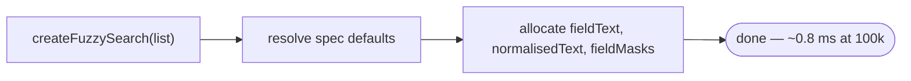
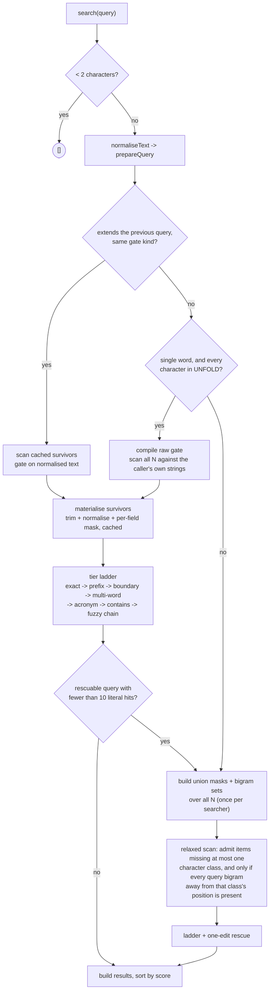

# The pipeline, and where the time goes

What `createFuzzySearch` builds, what a `search(query)` call does, how many of your records reach each stage, and what each stage costs.
Companion to [optimisation.md](./optimisation.md) (what moved the numbers) and [measurement.md](./measurement.md) (how the harness came to be wrong).

Counts and costs come from `pnpm --filter=krino-bench exec vitest run cost.test.ts`, over the fourteen single-word probes at 100k, both corpora.
Stage costs are measured by difference, so they overlap slightly.

## Build

**Construction reads nothing.** It resolves the field specs and allocates the buffers survivors will later be written into. No text is trimmed, normalised or copied, and no mask is computed. At 100k that is ~0.8 ms of allocation and nothing else.

Everything an index would hold is built on demand, by the two mechanisms below.

## Query

Three things decide which path a query takes: whether it extends the previous one, whether it is a single word made of characters the fold table covers, and whether it needs a correction.

## Who reaches what, and what it costs

ascii 100k, mean over fourteen single-word probes:

| stage | records in | records out | cost |
|---|---:|---:|---:|
| construction | — | — | ~0.8 ms |
| raw gate (first query) | 100,000 | **517 — 0.52%** | 3.25 ms |
| materialise survivors | 517 | 517 | 0.08 ms |
| tier ladder | 517 | **413 results** | 0.18 ms |
| — rescue path only — | | | |
| union mask + bigram build | 100,000 | — | **11.8 ms**, once per searcher |
| relaxed scan + rescue | 100,000 | **5,222 — 5.2%** | 1.39 ms |

Mixed 100k is the same shape and tighter: the raw gate leaves **197 records, 0.20%**, at 3.29 ms; the ladder produces 147 results in 0.03 ms; the rescue's mask build is 12.0 ms and its relaxed scan admits 3,223 records (3.2%) at 0.90 ms.

Two things stand out.

**The literal path is almost free once the gate has run.** 0.52% of the corpus survives it, and everything downstream — materialising, normalising, masking and running the full tier ladder on those survivors — costs 0.26 ms against the gate's 3.25. The gate *is* the query.

**The rescue is a different pipeline.** It admits **5.2% of the corpus**, ten times what the literal gate lets through, and it is the only thing that needs a whole-corpus index. Nine of the fourteen ascii probes take it, eight of fourteen on mixed — but that is a property of a deliberately typo-heavy probe set, not of ordinary use.
It used to admit 19.3% on a character-class test alone; the bigram stage — a field missing one class is only reachable by an edit at that class's query position, so every query bigram away from that position must be present — cut the set 3.7× and the scan's cost with it.

## Two costs that only some sessions pay

**The union masks and bigram sets, ~12 ms.** Built the first time a query is rescuable *and* turns up fewer than ten literal hits — because below that a correction can still reach the visible page, and only a mask can admit the near-misses the literal gate rejected. A session whose queries all match literally never builds them. Multi-word and non-Latin queries have no raw-gate form, so they take the mask path and force the build immediately.
The class mask and the bigram sets come from one fused scan per field (`rawFieldScan`), folding each code unit exactly once; the two-pass build it replaced cost ~18.5 ms.

**The raw gate, ~3.3 ms.** Paid by any query that cannot narrow: the first one, and any later one that isn't an extension of its predecessor. A typed sequence pays it once; a searcher handed unrelated queries pays it every time.

Those two are the design's central trade, and it is a trade, not a win: against an eagerly-built index the first query is cheaper and a long run of unrelated queries is dearer.

## What the survivor cache does

Each query leaves behind the set that passed its gate. The next query, if it extends the last one, scans only that set — and the set shrinks with every keystroke, because each one re-gates what the previous one kept.

Soundness rests on the filters being monotone under extension: an item the shorter query rejected stays rejected. Two things break that and are checked for explicitly. A query that has *become* rescuable needs near-misses a literal-gated set never held. And a multi-word query needs candidates the subsequence gate has already dropped, since the multi-word tier matches out of order.

The rescue path deliberately ignores the cache: it scans all N, because the near-misses it wants are exactly what the cached set excluded.

## Where the remaining time is

For a query that returns a lot, none of the above is the story. At three characters — 39,400 candidates, 15,722 results — the split is mask 0.29 ms, gate 1.50, ladder 2.62, and **building and sorting the result objects 7.13 ms, 62% of the query.**

Filtering is solved. 0.52% of records reach the ladder and the ladder costs 0.16 ms. What remains is proportional to how many results a query has, not how many records it searched, and the only thing that changes that curve is returning fewer of them.
